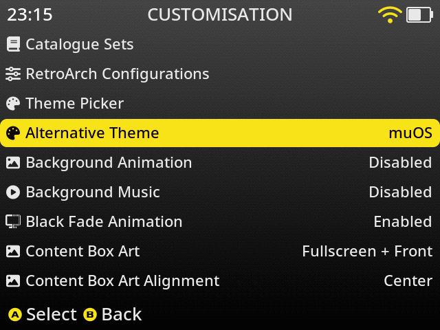
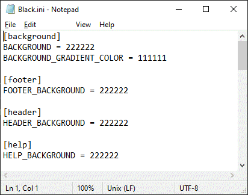

# Theme Alternatives Introduction
Theme Alternatives allows you to include multiple version of your theme in one theme file.  After installing your theme the user will be able to navigate to the  `Congiguration -> Customisation` menu and set which `Alternative Theme` to use.  The user would then press `A` to activate or press `B` to activate and exit the `Customisation` menu.



> *Examples of using Theme Alternatives can be found on the [theme](https://theme.muos.dev/) website.<br>
`muOS - Pixie - Grid` By: Bitter Bizarro<br>
`Aurora` By: Rosabel*

# Alternative Scheme .ini
The first way of creating a `Alternative Theme` options is by creating scheme files that adjust the styling of the theme.  The files should be located in `alternate` folder at root level of your theme archive.  The name used for each `.ini` is the name that will display in the `Congiguration -> Customisation` menu under the `Alternative Theme` setting. For example the `muOS - Pixie - Grid` has a structure like this:

```
.
├── active.txt
├── alternate
│   └── Black.ini
│   └── Blue.ini
│   └── Green.ini
│   └── muOS.ini
│   └── Orange.ini
│   └── Purple.ini
│   └── Red.ini
│   ├── rgb
│   │   ├── Black
|   |   │   └── rgbconf.sh
│   │   ├── Blue
|   |   │   └── rgbconf.sh
│   │   ├── Green
|   |   │   └── rgbconf.sh
│   │   ├── muOS
|   |   │   └── rgbconf.sh
│   │   ├── Orange
|   |   │   └── rgbconf.sh
│   │   ├── Purple
|   |   │   └── rgbconf.sh
│   │   ├── Red
|   |   │   └── rgbconf.sh
```

Each `Alternative Theme` scheme file can include any setting but keep in mind these settings will apply to all muOS screens and resolutions.  Typically you would use the files to change various colour parameters.  


*Example*

